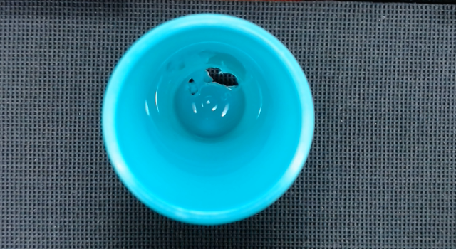
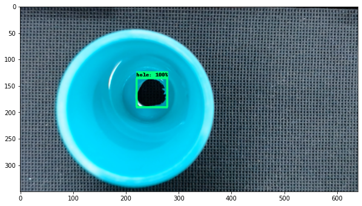

# TensorFlow Model Zoo Script - Custom Model

This repository is an object detection applied using the: 
[TensorFlow Object Detection API](https://github.com/tensorflow/models/tree/master/research/object_detection). 

Good reference video using the code and more explanations: [Tensorflow Object Detection in 5 Hours with Python | Full Course with 3 Projects
](https://www.youtube.com/watch?v=yqkISICHH-U)

The dataset is a set of cup images with tiny holes on your superficial. The label was annotated using 
[labelImg graphical image annotation tool](https://github.com/tzutalin/labelImg).

Detections provided from demo eval:

## Workspace

- Ubuntu 22.04
- CUDA Toolkit 11.2
- cuDNN v8.1.1
- Python 3.8
- Libraries: [requirements.txt](requirements.txt)
